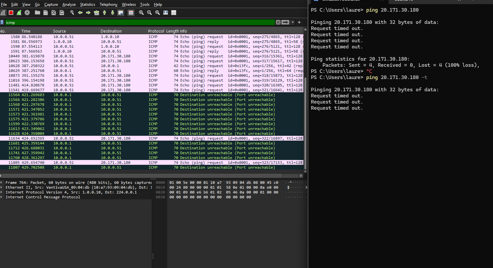
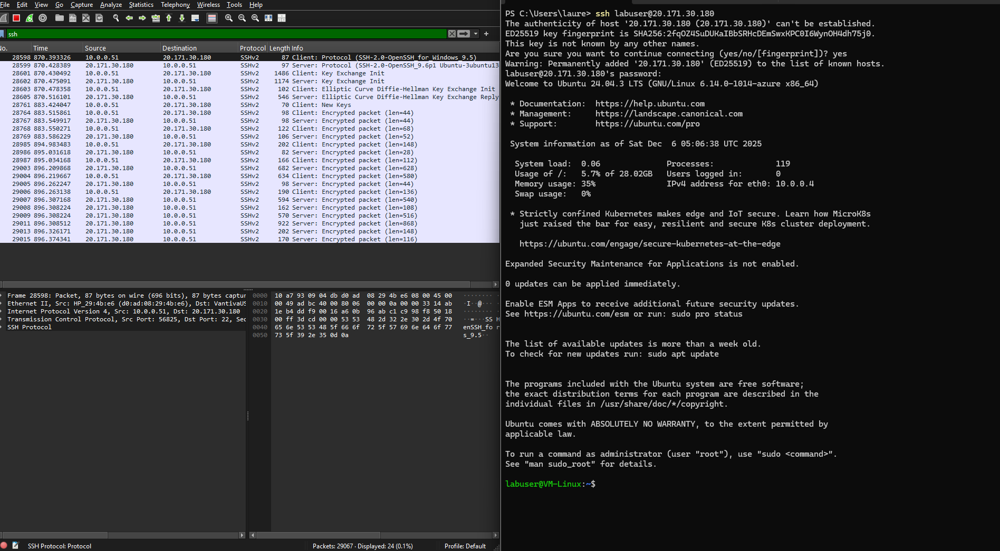
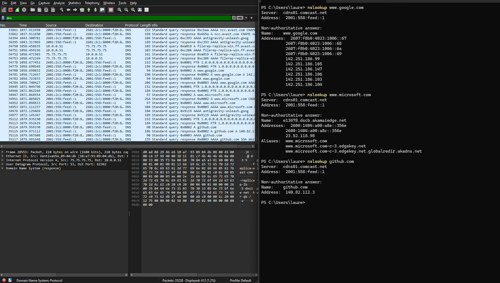
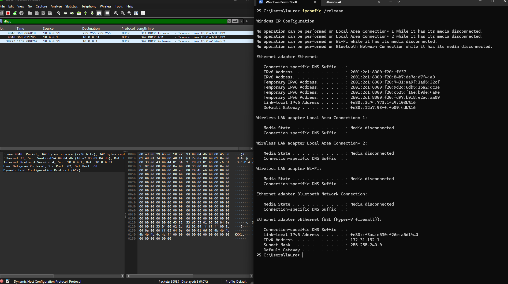

# Network Security Groups (NSGs) and Inspecting Traffic Between Azure VMs


## 📖 Overview

This tutorial demonstrates how to observe and analyze **network traffic between Azure Virtual Machines** using **Wireshark**. You'll inspect various network protocols (ICMP, SSH, DHCP, DNS, RDP) and learn to control traffic using **Network Security Groups (NSGs)**.

**Skills Demonstrated:**
- Azure network configuration
- Protocol analysis with Wireshark
- Network Security Group management
- Traffic filtering and inspection
- Understanding common network protocols

---

## 🏗️ Lab Setup

**Resources Used:**
- **Local Computer**: Windows with Wireshark installed (for packet capture)
- **Azure VM**: Ubuntu Server 22.04 (for testing network protocols)
- **Virtual Network**: Azure VNet with Network Security Groups
- **Network Protocols**: ICMP, SSH, DNS, DHCP

> [!NOTE]
> **Azure Free Trial Friendly**: This lab uses **1 Linux VM** which works with Azure free trial restrictions. Total cost: approximately **$0.50-$2.00** of Azure credits for 1-2 hours of work. Remember to **delete all resources** when finished!

> [!TIP]
> **Why Local Wireshark?** Some Azure free trials block Windows VMs. Running Wireshark locally and capturing traffic to/from Azure achieves the same learning objectives while staying within free tier limits!

---

## 🚀 Part 1: Create Azure Resources

### 1. Create Resource Group

1. In [Azure Portal](https://portal.azure.com), create a **Resource Group**:
   - Name: `NetworkLab-RG`
   - Region: Choose your preferred region

### 2. Create Ubuntu Server VM

1. Create a VM:
   - **Name**: `VM1-Linux`
   - **Image**: Ubuntu Server 22.04 LTS
   - **Size**: Standard_B1s (1 vCPU, 1 GB RAM)
   - **Authentication**: Password
   - **Username**: `labuser`
   - **Password**: (create a strong password)
   - **Virtual Network**: Azure will create `VM-Linux-vnet` automatically
   - **Public inbound ports**: Allow **SSH (22)**

2. **Important**: Note the **Public IP address** after creation - you'll need it!

---

## 🔍 Part 2: Install and Configure Wireshark

### 3. Install Wireshark on Your Local Computer

1. Download Wireshark from: https://www.wireshark.org/download.html
2. Install **Wireshark for Windows** (or your OS)
3. During installation:
   - Install **Npcap** (required for packet capture)
   - **Uncheck** "Restrict to administrators only"
   - **Check** "WinPcap API-compatible mode"

4. Launch Wireshark
5. Select your active network adapter (Ethernet or Wi-Fi)
6. Start capturing

---

## 🌐 Part 3: Observe Network Protocols

### 4. Configure Azure Network Security Group (NSG)

By default, Azure blocks ICMP traffic. Let's see this in action!

1. In Wireshark, set filter: `icmp`
2. Open PowerShell and ping your Azure VM's **public IP**:
   ```powershell
   ping <VM-Public-IP> -t
   ```
3. Observe: Wireshark shows "Destination unreachable" - ping is **blocked**!



#### 4a. Allow ICMP Through NSG

1. In Azure Portal: **VM1-Linux** → **Networking** → **Add inbound port rule**
2. Configure:
   - **Protocol**: ICMP
   - **Action**: Allow
   - **Priority**: 300
   - **Name**: Allow-ICMP
3. Click **Add**

4. Back in Wireshark: Ping now succeeds! See both request and reply packets.



---

### 5. Observe SSH Traffic

1. In Wireshark, filter: `ssh` or `tcp.port == 22`
2. SSH into your Azure VM:
   ```powershell
   ssh labuser@<VM-Public-IP>
   ```
3. Run some commands:
   ```bash
   ls
   pwd
   whoami
   ```
4. In Wireshark, observe **encrypted SSH packets**



**Note:** SSH packets show as "Encrypted packet" - you can see the traffic but not the content!

---

### 6. Observe DNS Traffic

1. In Wireshark, filter: `dns`
2. From PowerShell, query DNS:
   ```powershell
   nslookup www.google.com
   nslookup www.microsoft.com
   nslookup github.com
   ```
3. Observe DNS queries and responses with resolved IP addresses



---

## 🌐 Part 3: Observe Network Protocols

### 5. Observe ICMP Traffic (Ping)

1. In Wireshark, filter for **ICMP**: type `icmp` in filter box
2. Get **VM2-Linux** private IP address from Azure Portal
3. Open **PowerShell** on VM1-Windows and ping VM2:
   ```powershell
   ping 10.0.0.5 -t
   ```
4. Observe ICMP requests and replies in Wireshark


#### 5a. Block ICMP with NSG

1. In Azure Portal, go to **VM2-Linux** → **Networking** → **Network Security Group**
2. Add **Inbound Security Rule**:
   - Priority: `290`
   - Source: `Any`
   - Destination: `Any`
   - Protocol: `ICMP`
   - Action: **Deny**
3. Back in VM1-Windows, observe ping requests **time out**
4. Wireshark shows requests but **no replies**


5. **Re-enable** ICMP by deleting or setting rule to **Allow**

---

### 6. Observe SSH Traffic

1. In Wireshark, filter for **SSH**: type `ssh` or `tcp.port == 22`
2. From VM1-Windows PowerShell, SSH into VM2:
   ```powershell
   ssh labuser@10.0.0.5
   ```
3. Enter password and run commands:
   ```bash
   ls
   pwd
   uname -a
   ```
4. Observe encrypted SSH packets in Wireshark


## 🛡️ Part 4: Network Security Groups Demonstration

### 8. NSG Rules in Action

You've already seen NSG rules blocking and allowing ICMP traffic. This demonstrates:

- ✅ How Azure firewalls (NSGs) control traffic
- ✅ Default-deny security posture
- ✅ Rule priority and configuration
- ✅ Before/after comparison of firewall changes

**Additional NSG experiments** (optional):
- Block SSH (port 22) - watch connection fail
- Allow only specific IP addresses
- Configure outbound rules

---

## 🎓 What You Learned

- ✅ Installing and using Wireshark for packet analysis
- ✅ Creating and configuring Azure VMs and Virtual Networks
- ✅ Observing and identifying network protocols:
  - **ICMP** (ping/echo) - Network reachability testing
  - **SSH** (port 22) - Encrypted remote access
  - **DNS** (port 53) - Domain name resolution
- ✅ Configuring Network Security Groups (NSGs) in Azure
- ✅ Understanding how firewalls control inbound/outbound traffic
- ✅ Analyzing encrypted vs. unencrypted traffic
- ✅ Understanding how network packets flow between systems

---

## 🛠️ Technologies Used

- **Cloud Platform**: Microsoft Azure (VMs, VNets, NSGs)
- **Operating Systems**: Windows (local), Ubuntu Server 22.04 (Azure)
- **Network Tools**: Wireshark, PowerShell, SSH
- **Protocols**: ICMP, SSH, DNS, TCP/IP
- **Security**: Network Security Groups, Firewall rules

---

## 🧹 Cleanup

**To avoid Azure charges**, delete all resources when finished:

```powershell
Remove-AzResourceGroup -Name "NetworkLab-RG" -Force
```

Or via Portal: Resource Groups → `NetworkLab-RG` → **Delete resource group**

---

## 📝 Key Takeaways

- **Wireshark** is the industry-standard tool for network traffic analysis
- **Azure NSGs** provide network-level security controls similar to traditional firewalls
- **Protocol understanding** is essential for network troubleshooting:
  - **ICMP**: Tests network connectivity (ping)
  - **SSH**: Secure, encrypted remote access (port 22)
  - **DNS**: Translates domain names to IP addresses (port 53)
- **Security posture**: Azure uses default-deny rules - you must explicitly allow traffic
- Always **clean up cloud resources** to prevent unexpected charges
- Capturing traffic locally can be more cost-effective than deploying multiple cloud VMs

---

## 📚 Further Learning

- Explore advanced Wireshark filters
- Study OSI model layers
- Learn about VPN and site-to-site connections
- Practice creating complex NSG rule sets
- Investigate Azure Firewall and Application Gateway

---

## 📝 License

This is a learning project for IT portfolio demonstration purposes.
